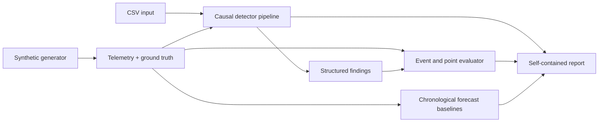

# Telemetry Quality Lab

Reliable monitoring starts with reliable telemetry. Telemetry Quality Lab generates reproducible
multivariate sensor data with known quality failures, detects those failures with causal and
explainable methods, and measures the results against ground truth. One command produces the data,
findings, benchmark metrics, quality scores, and a self-contained HTML report.

```bash
tqlab demo --output artifacts/demo --seed 42
```

The bundled datasets are entirely synthetic. Runs are deterministic for a given configuration and
seed, so every finding can be inspected and every benchmark can be repeated.

This public repository is an independent reconstruction of a time-series quality project first
explored during a data-engineering internship. It contains no employer code, data, branding,
credentials, internal identifiers, or proprietary assets.

## What it does

- Generates correlated temperature-, pressure-, and vibration-like signals from a shared operating
  load curve.
- Injects labeled missing blocks, timestamp gaps, duplicates, spikes, flatlines, level shifts, and
  noise bursts after a clean calibration period.
- Applies trailing-window detectors that never use observations from the future.
- Evaluates both event detection and affected points, including false positives and detection delay.
- Compares seasonal-naive and rolling-mean forecasts on a strictly chronological holdout.
- Reports completeness, timeliness, uniqueness, validity, stability, and an explicit weighted score.
- Exports CSV and JSON artifacts alongside a portable HTML report with embedded charts.

## Quick start

Python 3.11 or newer is required.

```bash
python -m venv .venv
source .venv/bin/activate
python -m pip install -e ".[dev]"

tqlab demo --output artifacts/demo
open artifacts/demo/report.html
```

The same interface is available through `python -m tqlab`.

## Commands

Generate a labeled scenario without running detection:

```bash
tqlab generate \
  --scenario mixed \
  --duration 72h \
  --frequency 5min \
  --seed 42 \
  --output artifacts/generated
```

Scan any CSV containing a timestamp and numeric signal columns:

```bash
tqlab scan telemetry.csv \
  --timestamp timestamp \
  --config configs/default.yaml \
  --output artifacts/scan
```

Run the reproducible multi-scenario benchmark:

```bash
tqlab benchmark \
  --suite configs/benchmark.yaml \
  --seeds 11,23,47 \
  --output artifacts/benchmark
```

Available generated scenarios are `clean`, `spikes`, `outage`, `flatline`, `shift`, `noise`, and
`mixed`.

Compare lightweight one-step-ahead forecasting baselines without adding a machine-learning stack:

```bash
tqlab forecast artifacts/generated/telemetry.csv \
  --signal temperature \
  --seasonal-period 288 \
  --rolling-window 12 \
  --output artifacts/forecast
```

The final 20 percent is the default holdout. At a five-minute cadence, a seasonal period of 288
represents one day. Both baselines use only actual values strictly before each predicted timestamp.
The command writes forecasts, MAE, RMSE, sMAPE, a run manifest, and a self-contained comparison
report.

## Demo artifacts

```text
artifacts/demo/
├── telemetry.csv
├── ground_truth.csv
├── findings.csv
├── signal_summary.csv
├── metrics.csv
├── generation_manifest.json
├── run_manifest.json
└── report.html
```

No benchmark number is hard-coded in this repository. The CLI calculates the results from the
generated labels and detector output on each run.

## Detection methods

| Quality failure | Method | Why it is explainable |
| --- | --- | --- |
| Duplicate timestamp | Exact uniqueness check | Reports the timestamp and duplicate count |
| Timestamp gap | Median cadence ratio | Reports expected cadence, observed gap, and estimated missing rows |
| Missing values | Contiguous run detection | Reports the affected interval and point count |
| Spike | Trailing Hampel filter | Reports the prior-window median, robust scale, score, and threshold |
| Flatline | Tolerance-aware run length | Reports duration, tolerance, and minimum required points |
| Level shift | Adjacent trailing medians | Reports window size, calibrated scale, persistence, and maximum score |
| Noise burst | Rolling difference-MAD ratio | Reports local-to-baseline variation and persistence |

The first 20 percent of generated data is guaranteed to be free from injected defects and is used
for scale calibration. All value detectors use trailing windows. `detected_at` therefore represents
when the evidence first became sufficient, enabling honest delay measurement.

After detection, an overlap-consolidation step prefers persistent explanations over instantaneous
alerts on the same signal and pairs nearby shift boundaries into one excursion. This prevents one
underlying failure from being counted repeatedly while preserving its evidence and causal alert time.

## Evaluation

Event metrics use one-to-one temporal matching within one sampling interval. Point metrics expand
truth and findings onto the inferred regular time grid. The output includes:

- Event precision, recall, and F1.
- Point precision, recall, and F1.
- False-positive rate over known-clean points.
- Mean causal detection delay for matched events.
- Per-defect and micro-aggregated counts.

The clean scenario is part of the default suite, which makes false-alarm behavior visible instead of
measuring only injected failures. See [the methodology](docs/methodology.md) for definitions and
limitations.

## Quality score

The score is not a learned model. It is a documented weighted average of five 0–100 dimensions:

| Dimension | Default weight | Evidence |
| --- | ---: | --- |
| Completeness | 25% | Missing observations |
| Timeliness | 20% | Estimated missing cadence slots and arrival-order errors |
| Uniqueness | 15% | Duplicate timestamps |
| Validity | 20% | Robust spike findings |
| Stability | 20% | Flatline, level-shift, and noise-burst intervals |

Raw counts and every dimension are exported with the aggregate, so the score never hides its inputs.

## Architecture



The package uses a `src/` layout, typed domain records, configuration validation, stable finding IDs,
and deterministic manifests. CI checks formatting, linting, coverage, and wheel/sdist builds on
Python 3.11–3.13.

## Boundaries

- This is a batch inspection and benchmarking toolkit, not a hosted monitoring service.
- The included detectors are univariate; cross-signal constraints require domain knowledge.
- Synthetic benchmarks are useful for reproducibility but do not replace validation on a target
  system's operating regimes.
- Thresholds must be calibrated to the cadence, variability, and consequences of a real dataset.

## Rights

Copyright © 2026 Safouh Al Ajlani. All rights reserved. The repository is available for portfolio
review and does not grant an open-source license. See [RIGHTS.md](RIGHTS.md).
